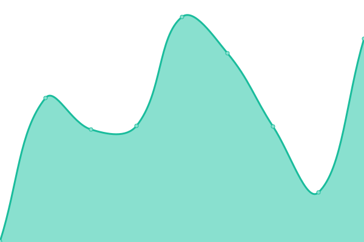

# [📈 Live Status](https://Elite Vault Protocol Status.github.io/evpstatus): <!--live status--> **🟥 Complete outage**

This repository contains the open-source uptime monitor and status page for [Elite Vault Protocol Status](https://Elite Vault Protocol Status.github.io/evpstatus), powered by [Upptime](https://github.com/upptime/upptime).

With [Upptime](https://upptime.js.org), you can get your own unlimited and free uptime monitor and status page, powered entirely by a GitHub repository. We use [Issues](https://github.com/Elite Vault Protocol Status/evpstatus/issues) as incident reports, [Actions](https://github.com/Elite Vault Protocol Status/evpstatus/actions) as uptime monitors, and [Pages](https://Elite Vault Protocol Status.github.io/evpstatus) for the status page.

<!--start: status pages-->
<!-- This summary is generated by Upptime (https://github.com/upptime/upptime) -->
<!-- Do not edit this manually, your changes will be overwritten -->
<!-- prettier-ignore -->
| URL | Status | History | Response Time | Uptime |
| --- | ------ | ------- | ------------- | ------ |
|  [EVP main website](https://elitevault.io) | 🟥 Down | [evp-main-website.yml](https://github.com/goosen999/evpstatus/commits/HEAD/history/evp-main-website.yml) | 

 160ms
     
 | 

<a href="https://goosen999.github.io/evpstatus/history/evp-main-website">97.24%</a>
    

|  [EVP buy website](https://buy.elitevault.io) | 🟥 Down | [evp-buy-website.yml](https://github.com/goosen999/evpstatus/commits/HEAD/history/evp-buy-website.yml) | 

 172ms
     
 | 

<a href="https://goosen999.github.io/evpstatus/history/evp-buy-website">97.24%</a>
    

|  [EVP vault website](https://vault.elitevault.io) | 🟥 Down | [evp-vault-website.yml](https://github.com/goosen999/evpstatus/commits/HEAD/history/evp-vault-website.yml) | 

 143ms
     
 | 

<a href="https://goosen999.github.io/evpstatus/history/evp-vault-website">97.24%</a>
    

<!--end: status pages-->

[**Visit our status website →**](https://Elite Vault Protocol Status.github.io/evpstatus)

## 📄 License

- Powered by: [Upptime](https://github.com/upptime/upptime)
- Code: [MIT](./LICENSE) © [Elite Vault Protocol Status](https://Elite Vault Protocol Status.github.io/evpstatus)
- Data in the `./history` directory: [Open Database License](https://opendatacommons.org/licenses/odbl/1-0/)
